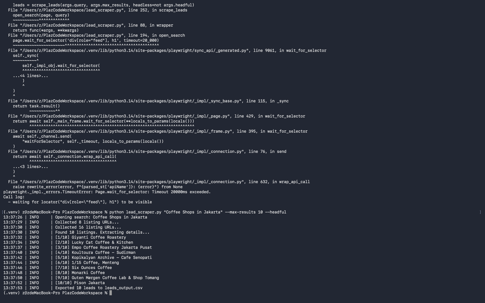
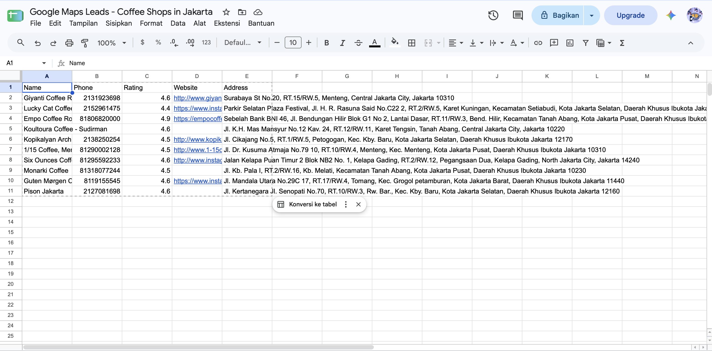

<h1 align="center">📍 Google Maps Lead Scraper</h1>

  <b>Turn any search like "Coffee Shops in Jakarta" into a clean, ready-to-use lead list in minutes.</b>

  
  
  
  
  

---

## 🚀 Value Proposition

Stop copy-pasting business details by hand: this tool automatically extracts **Name, Phone, Rating, Website, and Address** for any business category in any city. With stealth browsing, smart retries, and built-in data cleaning, you get a deduplicated CSV your sales team can use immediately.

## ✨ Features

- 🔎 **Any query** - search any niche and location (`"Dentists in Bali"`, `"Gyms in Surabaya"`)
- 🥷 **Stealth mode** - real browser user agent, safe headers, randomized viewports, human-like delays, and hidden automation fingerprints
- 🔁 **Retry logic** - exponential backoff with jitter on timeouts and network hiccups
- 🛡️ **Fault tolerant** - one broken listing never crashes the whole run
- 🧹 **Clean output** - normalized phone numbers, parsed ratings, deduplicated rows
- 📦 **Modular code** - small, single-purpose functions that are easy to extend

## 🧰 Tech Stack

| Tool | Purpose |
| --- | --- |
| [Python 3.9+](https://www.python.org/) | Core language |
| [Playwright](https://playwright.dev/python/) | Headless browser automation |
| [pandas](https://pandas.pydata.org/) | Data cleaning and CSV export |

## ⚡ Quickstart

**1. Clone the repo**

~~~bash
git clone https://github.com/matthewdotcom/google-maps-lead-scraper.git
cd google-maps-lead-scraper
~~~

**2. Create a virtual environment and install dependencies**

~~~bash
python -m venv .venv
source .venv/bin/activate      # Windows: .venv\Scripts\activate
pip install -r requirements.txt
playwright install chromium
~~~

**3. Run the scraper**

~~~bash
python lead_scraper.py "Coffee Shops in Jakarta" --max-results 50
~~~

**4. Open your leads** - results are saved to `leads_output.csv`.

### CLI Options

| Flag | Default | Description |
| --- | --- | --- |
| `query` | *(required)* | Search term, e.g. `"Coffee Shops in Jakarta"` |
| `--max-results` | `50` | Maximum number of listings to scrape |
| `--output` | `leads_output.csv` | Output CSV file path |
| `--headful` | off | Show the browser window (useful for debugging) |

### Sample Output

| Name | Phone | Rating | Website | Address |
| --- | --- | --- | --- | --- |
| Example Coffee Co. | +62211234567 | 4.7 | https://example.com | Jl. Sudirman No. 1, Jakarta |

## 🖼️ Screenshots

> _Add your screenshots here._

| Terminal Run | CSV Output |
| --- | --- |
|  |  |

## 🗂️ Project Structure

~~~text
.
├── lead_scraper.py     # Scraper: browser setup, scraping, cleaning, export
├── requirements.txt    # Python dependencies
└── README.md
~~~

## ⚠️ Disclaimer

This project is for educational and research purposes. Automated scraping may violate Google's Terms of Service. You are responsible for using it legally, respecting rate limits, and complying with local data protection laws (e.g. GDPR, Indonesia's PDP Law) when storing or contacting leads.

## 🤝 Contributing

Pull requests are welcome. For major changes, please open an issue first to discuss what you would like to change.

## 📄 License

[MIT](LICENSE)
